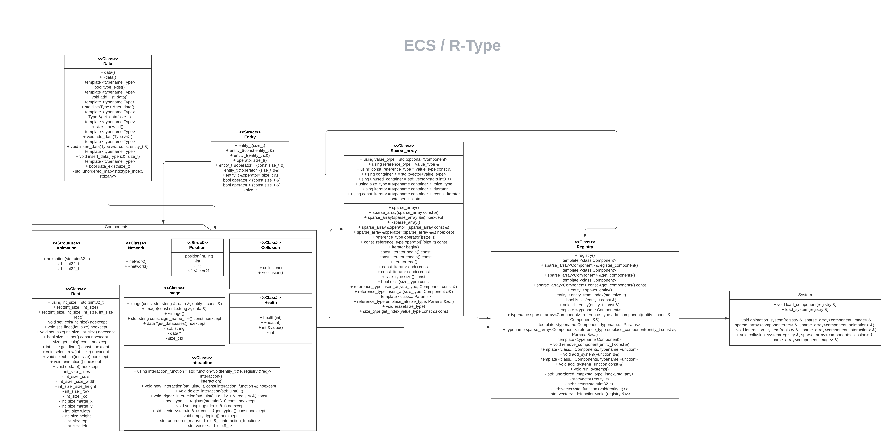

# ECS (Entity Component System)

## Présentation

Notre ECS est une bibliothèque C++ pour la gestion d'un système de composants de jeu. Elle est conçue pour être facilement intégrée dans un projet de jeu existant, en offrant une manière flexible et performante de gérer les différents aspects du gameplay en utilisant un modèle orienté objet.

- **Entités** : Les entités représentent des objets dans le jeu ou l'application, tels que des personnages, des ennemis, des objets, etc. Elles sont simplement des conteneurs vides qui ne contiennent pas de données directement.
- **Composants** : Les composants sont des données qui sont attachées aux entités pour leur donner des propriétés et des comportements spécifiques. Par exemple, un composant "Position" peut contenir les coordonnées x et y d'une entité sur l'écran, tandis qu'un composant "Vitesse" peut contenir la vitesse à laquelle une entité se déplace.
- **Systèmes** : Les systèmes sont des modules de traitement qui agissent sur les composants pour mettre à jour l'état des entités. Par exemple, un système "Mouvement" peut utiliser les composants "Position" et "Vitesse" pour mettre à jour la position d'une entité à chaque image.

## Comment ça marche ?



Notre ECS fonctionne en utilisant un système de composants et de systèmes. Les composants sont les éléments de base du gameplay, tels que la position, la santé, la vitesse, l'entrée utilisateur, etc. Chaque composant est stocké dans le namespace Component, qui contient une identité unique pour chaque type de composant.

- Création et suppression d'entités.
- Ajout, modification et suppression de composants sur des entités existantes.
- Interrogation des composants et des entités en fonction de leur type.
- Définition et utilisation de systèmes pour mettre à jour l'état des entités.

Les systèmes sont des entités logiques qui opèrent sur des collections de composants. Ils peuvent être utilisés pour mettre à jour la position des objets, traiter les entrées utilisateur, ou appliquer des effets spéciaux, entre autres choses. Chaque système est représenté par une instance de la classe ComponentSystem, qui contient une signature qui définit quels types de composants il utilise.

## Comment l'utiliser ?

Pour utiliser notre ECS dans votre projet, vous devez d'abord créer une instance de la classe Registry, qui contiendra toutes les instances de composants et de systèmes. Ensuite, vous pouvez créer des instances de composants en utilisant les différentes sous-classes de Component que vous avez définies, et les ajouter au registre en utilisant la méthode Registry::addComponent.

Ensuite, vous pouvez créer des systèmes en utilisant les sous-classes de ComponentSystem que vous avez définies, et les ajouter au registre en utilisant la méthode Registry::addSystem. Les systèmes seront automatiquement associés aux composants pertinents en fonction de leur signature.

Enfin, vous pouvez appeler la méthode Registry::update pour mettre à jour tous les systèmes et leurs composants associés.

```cpp
#include "Include/registry.hpp"
#include "Include/entity.hpp"
#include "Include/system.hpp"
```

## Comment personnaliser ?

Notre ECS est conçu pour être facilement personnalisable en fonction des besoins de votre projet. Vous pouvez ajouter de nouveaux types de composants en créant des sous-classes de Component, et vous pouvez ajouter de nouveaux types de systèmes en créant des sous-classes de ComponentSystem.

Vous pouvez également personnaliser la façon dont les composants sont initialisés en écrivant des parsers de composants personnalisés, qui prennent en entrée une chaîne de caractères et renvoient une instance du composant correspondant. Vous pouvez ajouter ces parsers au système de parsing en créant une sous-classe de ComponentParser et en ajoutant une instance de cette sous-classe au système de parsing en utilisant la méthode ParseSystem::addComponentParser.

## Conclusion

Notre ECS est une bibliothèque C++ flexible et performante pour la gestion des composants de jeu. En utilisant ce système, vous pouvez facilement gérer les différents aspects du gameplay de votre jeu, en créant des composants personnalisés et en les associant à des systèmes de traitement logique.